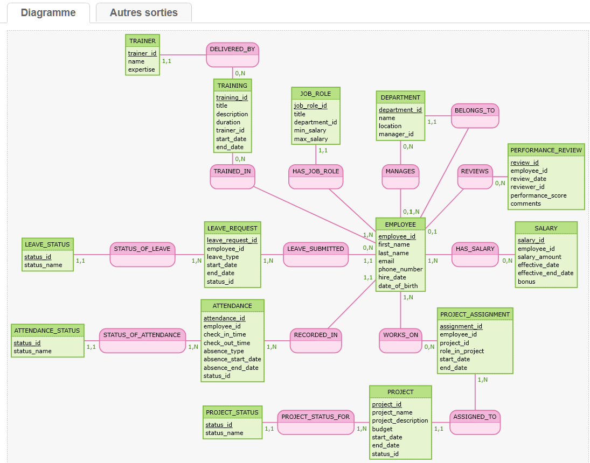

### Modèle Conceptuel de Données (MCD) – Gestion RH

#### EMPLOYEE
**Attributs** : `employee_id`, `first_name`, `last_name`, `email`, `phone_number`, `hire_date`, `date_of_birth`  
Un employé peut être affecté à plusieurs départements et projets. Il peut également suivre des formations, recevoir des évaluations, des salaires, et effectuer des demandes de congés.

#### DEPARTMENT
**Attributs** : `department_id`, `name`, `location`, `manager_id`  
Un département peut avoir plusieurs employés et un responsable. Il regroupe les postes selon les fonctions de l’entreprise.

#### POSITION
**Attributs** : `position_id`, `title`, `department_id`, `salary_range`  
Un poste appartient à un département et peut être occupé par plusieurs employés. Il détermine le rôle professionnel.

#### SALARY
**Attributs** : `salary_id`, `employee_id`, `salary_amount`, `effective_date`, `bonus`  
Un salaire est attribué à un employé. L’historique peut être conservé pour gérer les augmentations et bonus.

#### LEAVE_REQUEST
**Attributs** : `leave_request_id`, `employee_id`, `leave_type`, `start_date`, `end_date`, `status`  
Gère les demandes de congés formulées par les employés. Chaque demande peut avoir différents statuts (approuvée, rejetée, etc.).

#### PERFORMANCE_REVIEW
**Attributs** : `review_id`, `employee_id`, `review_date`, `reviewer_id`, `performance_score`, `comments`  
Évalue les performances des employés. Chaque évaluation est liée à un évaluateur (souvent un manager).

#### TRAINING
**Attributs** : `training_id`, `title`, `description`, `duration`, `trainer_id`, `start_date`, `end_date`  
Suit les formations suivies par les employés, internes ou externes.

#### PROJECT
**Attributs** : `project_id`, `project_name`, `project_description`, `budget`, `start_date`, `end_date`, `status`  
Liste les projets de l’entreprise. Chaque projet peut avoir plusieurs employés assignés.

#### PROJECT_ASSIGNMENT
**Attributs** : `assignment_id`, `employee_id`, `project_id`, `role_in_project`, `start_date`, `end_date`  
Permet de suivre quels employés travaillent sur quels projets, avec leur rôle et période d’affectation.

#### Associations (Mocodo syntax)
EMPLOYEE: employee_id, first_name, last_name, email, phone_number, hire_date, date_of_birth
DEPARTMENT: department_id, name, location, manager_id
POSITION: position_id, title, department_id, salary_range
SALARY: salary_id, employee_id, salary_amount, effective_date, bonus
LEAVE_REQUEST: leave_request_id, employee_id, leave_type, start_date, end_date, status
PERFORMANCE_REVIEW: review_id, employee_id, review_date, reviewer_id, performance_score, comments
TRAINING: training_id, title, description, duration, trainer_id, start_date, end_date
PROJECT: project_id, project_name, project_description, budget, start_date, end_date, status
PROJECT_ASSIGNMENT: assignment_id, employee_id, project_id, role_in_project, start_date, end_date

WORKS_ON, 0N EMPLOYEE, 1N PROJECT
MANAGES, 0N EMPLOYEE, 01 PROJECT
BELONGS_TO, 1N EMPLOYEE, 11 DEPARTMENT
HAS_POSITION, 1N EMPLOYEE, 11 POSITION
HAS_SALARY, 1N EMPLOYEE, 0N SALARY
REQUESTED_BY, 0N LEAVE_REQUEST, 11 EMPLOYEE
REVIEWED_FOR, 0N PERFORMANCE_REVIEW, 11 EMPLOYEE
TRAINED_BY, 0N TRAINING, 0N EMPLOYEE
ASSIGNED_TO, 0N PROJECT_ASSIGNMENT, 11 EMPLOYEE

#### Mocodo Diagramme

